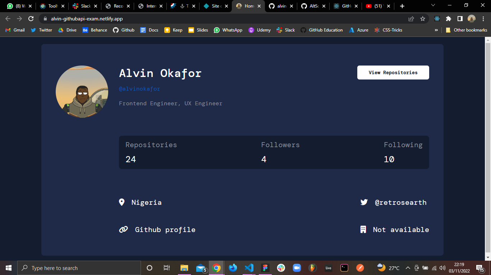
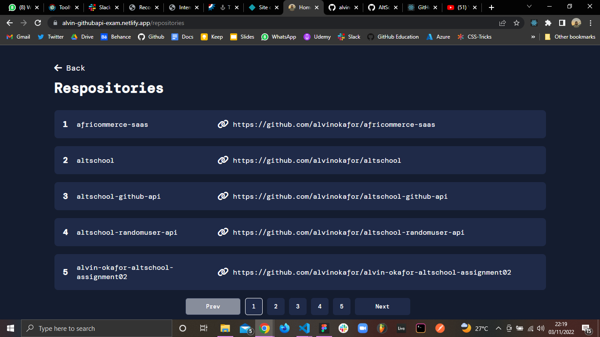
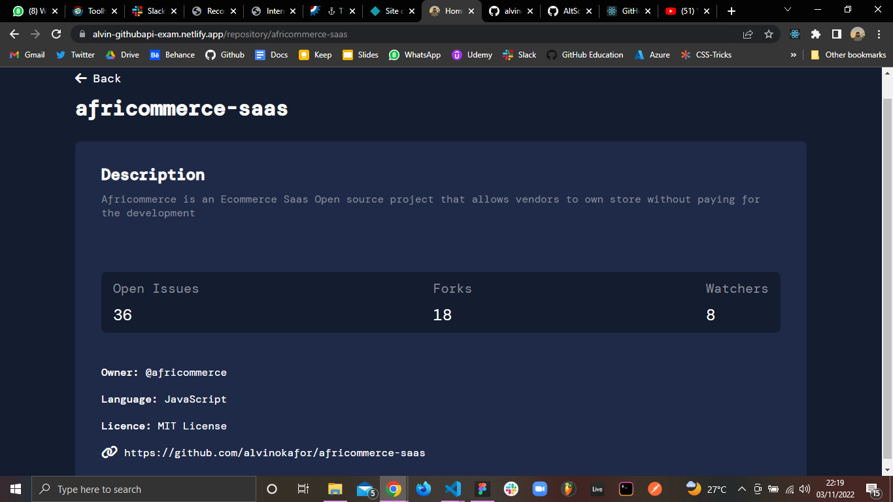

# AltSchool Second Semester Exam Project

## Project Question
Implement an API fetch of your GitHub portfolio, show a page with a list of all your repositories on GitHub, and show another page linking to each repo usinq nested routes while using all the necessary tools in react. Implement the proper SEO, Error Boundary (show a page to test the error boundary) and 404 pages. Good Ul and Designs are important.

[Website Link](https://alvin-githubapi-exam.netlify.app)

## Setup Instructions

To run the project locally on your machine, in the project directory, you can:

Clone the project by running:
### `git clone`

To install dependencies, cd into the project directory and run:
### `yarn`

To start the development server, run:
### `yarn run dev` 

Runs the app in the development mode.\
Open [http://localhost:your-given-port](http://localhost:your-given-port) to view it in your browser.

The page will reload when you make changes.\
You may also see any lint errors in the console.

## Project overview

The website contains three pages: Home, Repositories and Repository Details

* Home Page: Here you are able to see informatio about the user

* Repositories Page: On this page you can see the entire list of the users repositories 
  
* Repository Details Page: On this page you can view the details of a particular repository clicked on 

## Project Preview

